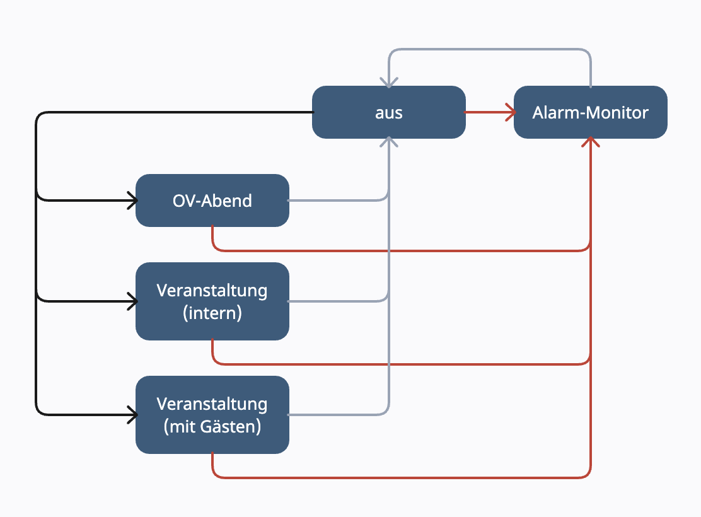

// see https://gist.github.com/dcode/0cfbf2699a1fe9b46ff04c41721dda74 and the related comments for tipps to GitHub Flavored Asciidoc
:doctype: article
:license-type: MIT
:source-highlighter: rouge
:rouge-style: github
:icons: font
:toc: preamble

// GitHub doesn't render asciidoc exactly as intended, so we adjust settings
ifdef::env-github[]

:tip-caption: :bulb:
:note-caption: :information_source:
:important-caption: :heavy_exclamation_mark:
:caution-caption: :fire:
:warning-caption: :warning:

endif::[]

= Bildschirmsteuerung für OV Eingang
v0.1, 2024
q
Im Eingang des link:https://de.wikipedia.org/wiki/THW-Ortsverband[Ortsverbands] (kurz "OV") ist ein großer Monitor montiert, der abhängig von der Situation unterschiedliche Informationen anzeigen soll.

Mithilfe des Codes in diesem Repository wird jene Funktionalität umgesetzt.

== Beschreibung der Ist-Situation
Technisch handelt es sich um einen link:https://de.wikipedia.org/wiki/High_Definition_Television[HD-Bildschirm].
Über HDMI erhält er das Bild von einem link:https://www.raspberrypi.com/products/raspberry-pi-3-model-b-plus/[Raspberry Pi 3 B+].
Dieser kleine PC hängt im LAN.
Es ist weder Tastatur noch Maus angeschlossen.

Unter den aktiven Helfern und anwesenden Ehemaligen wurde eine Umfrage durchgeführt, was sie idealerweise auf dem Bildschirm sehen wollen.
Hierbei wurden fünf unterschiedliche Szenarien identifiziert:

1. Einsatz/ Alarmierung
2. wöchentlicher OV-Abend
3. Veranstaltung mit Gästen (z.B. Lehrgang, Prüfungen, TdoT)
4. Veranstaltung ohne Gäste (z.B. Übung, Arbeitsdienst)
5. Zeit außerhalb von 1-4

Das folgende Bild zeigt die Zusammenhänge in einer grafischen Darstellung.

== Anforderungen
=== allgemein
* Das Gerät soll ausschließlich über LAN und nicht über WLAN betrieben werden, um das Risiko eines digitalen Einbruchs zu verhindern.
  Es soll ausschließlich über den Proxy des Ortsverbands auf das Internet zugegriffen werden.
* Als Datenablage und Informationsquellen soll auf bestehende Lösungen des OV zurückgegriffen werden.
  Das heißt, keine zusätzlichen Quellen wie Dropbox o.ä. oder zusätzlich zu bezahlende Onlineservices.
  Es existiert ein lokaler Server für die gemeinsame Dateiablage.
  Hier kann ein Ordner als zentrale Quelle für tagesspezifische Informationen etc. freigegeben und genutzt werden.
* Der Code muss in einer Skriptsprache implementiert werden.
  So ist sichergestellt, dass er auch noch angepasst werden kann, wenn der ursprüngliche Programmierer nicht mehr da ist.
  Mit kompilierten Binaries wäre dies nicht möglich.
* Zugangsdaten sind lokal zu halten und niemals Teil dieses Repositories!
  Sie sind weder hartverdrahtet im Code noch als Konfigurationsdatei im Repository einsehbar. 

=== Szenario 1: bei Alarmierung
Kernaufgabe jeder Hilfsorganisation ist der Einsatz bei einer Alarmierung.
Für eine Kommunikation mit den Helfern wird https://www.divera247.com/[DIVERA 24/7®] eingesetzt.
So können im Einsatzfall die Personen der notwendigen Gruppen benachrichtigt werden und über das Mobiltelefon eine Rückmeldung geben.
Über eine Statusseite (den sogenannten https://www.divera247.com/funktionen/alarm-monitor.html[Alarm-Monitor]) kann eine Übersicht der Rückmeldungen sowie der Einsatzmeldung übersichtlich dargestellt werden.

* Im Fall einer Alarmierung ist der Alarm-Monitor anzuzeigen.
  D.h. ein Alarm hat immer Prio 1 und überschreibt alle anderen Zustände, die auf dem Gerät angezeigt werden könnten.
* Sollte der Bildschirm ausgeschaltet sein, so soll er für die Zeit des Einsatzes eingeschaltet werden, damit die Informationen von den Helfern gesehen werden können.
* Die Details der anzuzeigenden Informationen werden innerhalb von Divera konfiguriert und sind nicht Teil dieser Implementierung.

=== Szenario 2: OV-Abend
Einmal pro Woche findet im OV ein gemeinsamer Abend statt.
Hier werden Übungen durchgeführt, Fahrzeuge und Geräte gewartet, Veranstaltungen vorbereitet und in gemütlicher Runde die Vergangenheit reflektiert oder Neues geplant.

Zielgruppe sind die aktiven Helfer im OV.
Zusätzlich gibt es einen Stammtisch der ehemals aktiven Rentner, die weiterhin ihr soziales Netzwerk pflegen.

* geplante Aktivitäten heute
* geplanten Veranstaltungen in den nächsten 2 bis 4 Wochen
* neueste Beiträge (inkl. Bild) von der OV-Webseite
* letzten News aus der Region (Landesverband)
* Meldungen und Ankündigungen aus dem OV-Stab (z.B. fehlende Dokumente, beschädigte Tore) -- idealerweise hervorgehoben dargestellt
* Meldungen und Ankündigungen vom Zugführer
* Wartungsterminen von Fahrzeugen und Material (z.B. Hauptuntersuchung)
* Lehrvideos (z.B. Arbeitsschutz, fachgruppenbezogene Videos)
* Helfersprecher (Foto + Name)
* offene Unterstützungsaufgaben (inkl. Ansprechperson) für Personen mit Freizeit
* Organigramm je Fachgruppe inkl. Fachbefähigungen
* ausgeliehene Geräte (seit wann und an wen)

=== Szenario 3: Veranstaltung mit Gästen
Veranstaltungen mit externen Gästen sind beispielsweise Lehrgänge (z.B. mit Feuerwehr oder Rotkreuz), Tag der offenen Tür oder THW-interne Prüfungen (Grundausbildung, Bereichsausbildung) mit Teilnehmern aus mehreren Standorten.
Die Teilnehmer kennen somit den OV nicht, weder vom Aufgabenbereich/ Leistungsfähigkeit noch von den lokalen Gegebenheiten.

Zielgruppe sind ortsfremde Personen.

* Titel
* Beginn
* angedachtes Ende
* Begrüßung ("Herzlich willkommen bei ...")
* Agenda/ Tagesplanung, jeweils mit Ort (Schulungsraum, Fahrzeughalle, Werkstatt, Hof, außerhalb)
* Name von Hauptansprechperson/ Leiter der Veranstaltung
* Lageplan/ Orientierungshilfe (Wo ist Raum? Wo ist WC?), ggf. als Piktogramm
* geplante Essenspausen (und wer der Koch ist)
* Bei THW-interner Veranstaltung: welche anderen OV sind zu Besuch?
* Bei THW-externer Veranstaltung: Informationen zum OV (Fachgruppen, Kurzvorstellung/ Aufgaben je FG, Werbevideos)
* Personalstärke (d.h. Anzahl Junghelfer/ Jugend, Anzahl Aktive), Anzahl Einsätze in den letzten 12 Monaten

=== Szenario 4: Veranstaltung ohne Gäste
Interne Veranstaltungen sind zum Beispiel Übungen, Arbeitsdienste, geplante technische Hilfeleistungen oder Ausflüge.
Sie können am wöchentlichen OV-Abend stattfinden oder an anderen Wochentagen.
Die Länge einer Veranstaltung kann von einer Stunde bis mehrere Tage sein. 

Zielgruppe sind die aktiven Helfer sowie die Jugend.

* Titel
* Beginn
* angedachtes Ende
* Ort
* Inhalt/ Tätigkeiten/ Beschreibung
* falls möglich, Zusagen (z.B. für Planung von Verpflegung)

=== Szenario 5: restliche Zeit
In der Zeit, wo kein anderes Szenario zutrifft, soll zum Zwecke des Stromsparens der Bildschirm ausgeschaltet sein.

// Let people know what your project can do specifically. Provide context and add a link to any reference visitors might be unfamiliar with. A list of Features or a Background subsection can also be added here. If there are alternatives to your project, this is a good place to list differentiating factors.

// Visuals
// Depending on what you are making, it can be a good idea to include screenshots or even a video (you'll frequently see GIFs rather than actual videos). Tools like ttygif can help, but check out Asciinema for a more sophisticated method.

== Installation
Siehe link:++./setup/README.adoc++

// Usage
// Use examples liberally, and show the expected output if you can. It's helpful to have inline the smallest example of usage that you can demonstrate, while providing links to more sophisticated examples if they are too long to reasonably include in the README.

// Support
// Tell people where they can go to for help. It can be any combination of an issue tracker, a chat room, an email address, etc.

// Roadmap
// If you have ideas for releases in the future, it is a good idea to list them in the README.

// Contributing
// State if you are open to contributions and what your requirements are for accepting them.

// For people who want to make changes to your project, it's helpful to have some documentation on how to get started. Perhaps there is a script that they should run or some environment variables that they need to set. Make these steps explicit. These instructions could also be useful to your future self.

// You can also document commands to lint the code or run tests. These steps help to ensure high code quality and reduce the likelihood that the changes inadvertently break something. Having instructions for running tests is especially helpful if it requires external setup, such as starting a Selenium server for testing in a browser.

== Danksagung
// Show your appreciation to those who have contributed to the project.

Ohne die gute fachliche Erklärung und den Code in https://github.com/Dustin1358/Raspberry-Pi-Divera-Monitor[Raspberry-Pi-Divera-Monitor] wäre dieses Projekt niemals möglich gewesen.

Auch das Vertrauen in die Sache sowie die Unterstützung der Kameraden und OV-Stab bei Diskussionen, Umfragen sowie Bewertung erster Prototypen war eine hohe Motivation.

== Lizenz
Siehe link:++./LICENSE++

// Project status
// If you have run out of energy or time for your project, put a note at the top of the README saying that development has slowed down or stopped completely. Someone may choose to fork your project or volunteer to step in as a maintainer or owner, allowing your project to keep going. You can also make an explicit request for maintainers.